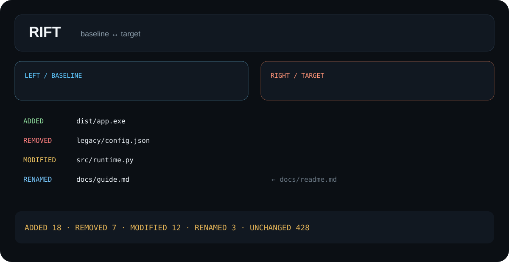

<div align="center">
  
  <h1>Rift</h1>
  <p><strong>Compare two folders or builds and see exactly what changed.</strong></p>
  <p><a href="#run-from-source"><strong>Run from source</strong></a> · <a href="https://github.com/purysho/Rift/actions">CI builds</a> · <a href="https://github.com/purysho/Rift/issues">Report an issue</a></p>
</div>

Rift is a local-first folder and build comparison tool. It scans two directory trees, identifies added/removed/modified paths, and—when hashing is enabled—detects content-preserving renames.



## Features
- Side-by-side folder selection
- SHA-256 content comparison
- Rename detection
- Added / removed / modified / unchanged classification
- JSON and CSV exports
- Common generated folders ignored by default
- Read-only comparison: Rift does not alter either input tree

## Run from source
```powershell
pyw rift_desktop.pyw
```
Python 3.10+ with Tk support. Runtime uses only the standard library.

## Tests
```powershell
python -m unittest discover -s tests -v
```

## Windows build
```powershell
powershell -ExecutionPolicy Bypass -File .\build-windows.ps1
```

## Release model
Every push runs tests and creates a Windows CI artifact. Tags matching `v*` publish `Rift.exe` plus a SHA-256 checksum to GitHub Releases.

## License
MIT
