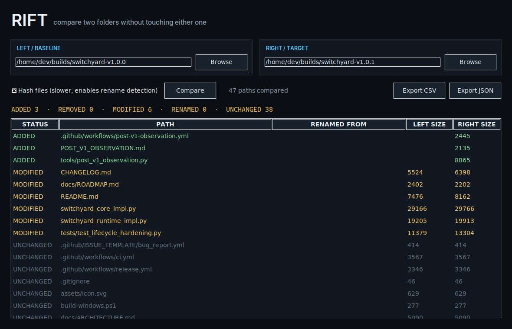

<div align="center">
  
  <h1>Rift</h1>
  <p><strong>Compare two folders or builds and see exactly what changed.</strong></p>
  <p>
    <a href="https://github.com/purysho/Rift/actions/workflows/ci.yml"></a>
    <a href="https://github.com/purysho/Rift/releases"></a>
    <a href="LICENSE"></a>
    <a href="#download"></a>
  </p>
  <p><strong>Download:</strong> <a href="https://github.com/purysho/Rift/releases/latest/download/Rift-Windows-x64.exe">Windows</a> · <a href="https://github.com/purysho/Rift/releases/latest/download/Rift-macOS-arm64.zip">macOS</a> · <a href="https://github.com/purysho/Rift/releases/latest/download/Rift-Linux-x86_64.tar.gz">Linux</a> · <a href="#run-from-source">Run from source</a> · <a href="https://github.com/purysho/Rift/issues">Report an issue</a></p>
</div>

Rift is a local-first folder and build comparison tool. It scans two directory trees, identifies added/removed/modified paths, and—when hashing is enabled—detects content-preserving renames.



## Features
- Side-by-side folder selection
- SHA-256 content comparison
- Rename detection
- Added / removed / modified / unchanged classification
- JSON and CSV exports
- Common generated folders ignored by default
- Read-only comparison: Rift does not alter either input tree

## Download

| Platform | File |
|---|---|
| Windows 10/11 (x64) | [Rift-Windows-x64.exe](https://github.com/purysho/Rift/releases/latest/download/Rift-Windows-x64.exe) — portable, no installer |
| macOS (Apple Silicon) | [Rift-macOS-arm64.zip](https://github.com/purysho/Rift/releases/latest/download/Rift-macOS-arm64.zip) — unzip and move to Applications |
| Linux (x86_64) | [Rift-Linux-x86_64.tar.gz](https://github.com/purysho/Rift/releases/latest/download/Rift-Linux-x86_64.tar.gz) — extract and run `./Rift` |

Each [release](https://github.com/purysho/Rift/releases) is built from the tagged source by GitHub Actions and carries a `SHA256SUMS.txt`. The builds are not yet code-signed, so on first launch Windows SmartScreen may ask you to confirm ("More info" → "Run anyway"), and macOS may need you to Control-click the app and choose **Open**.

**Status: beta.** Rift does what this README describes and is covered by CI on Windows, macOS and Linux, but it is young: expect rough edges, and please [report them](https://github.com/purysho/Rift/issues).

## Run from source
```powershell
pyw rift_desktop.pyw
```
Python 3.10+ with Tk support. Runtime uses only the standard library.

## Tests
```powershell
python -m unittest discover -s tests -v
```

## Windows build
```powershell
powershell -ExecutionPolicy Bypass -File .\build-windows.ps1
```

## Release model
Every push runs tests and creates a Windows CI artifact. Tags matching `v*` publish `Rift.exe` plus a SHA-256 checksum to GitHub Releases.

## License
MIT
